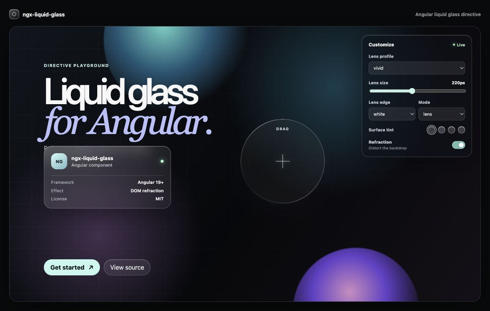
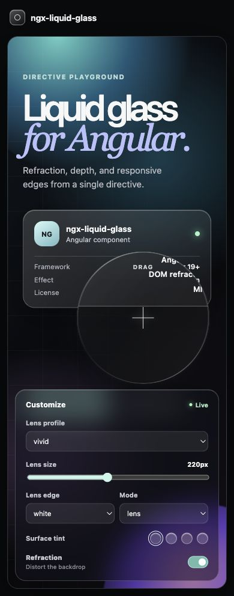
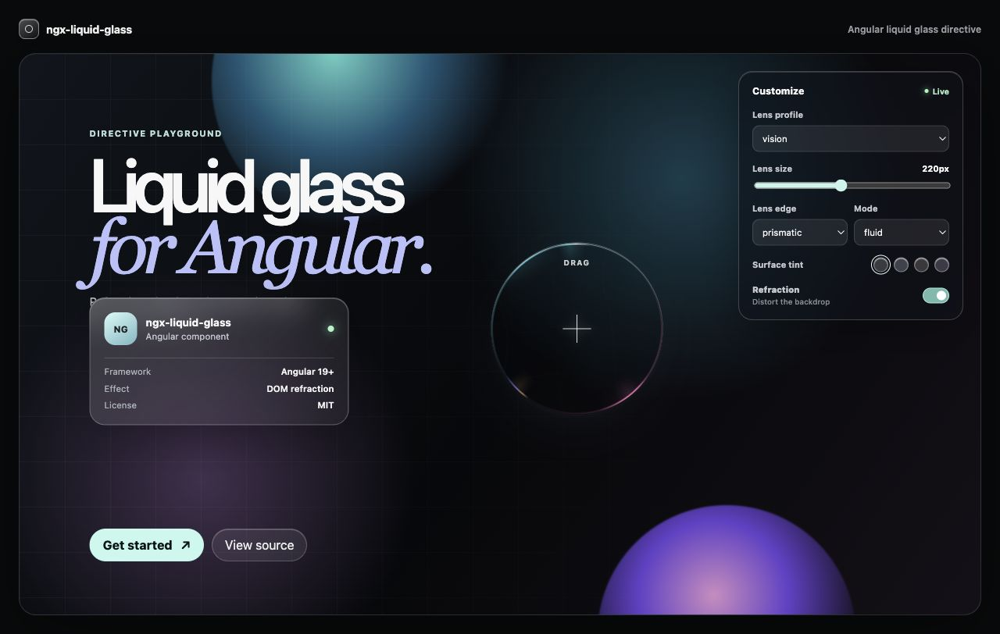

# ngx-liquid-glass

Angular standalone directive for Apple-style liquid glass surfaces. Drop it onto existing markup; no wrapper component, no root providers, and no required configuration.

## Demo

Try the interactive playground: **[ngx-liquid-glass live demo](https://sharma-anush-tft.github.io/ngx-liquid-glass/)**.

<p align="center">
  
</p>

<p align="center">
  
</p>

The playground exposes the directive's intensity, edge treatment, refraction mode, tint, and lens size controls. Drag the lens across the scene to see DOM-backed refraction in action.

### Prismatic fluid refraction

<p align="center">
  
</p>

## Install

```bash
ng add ngx-liquid-glass
```

Manual install:

```bash
npm install ngx-liquid-glass
```

## Minimal Usage

Import the standalone directive into the component that uses it:

```ts
import { Component } from '@angular/core';
import { NgxLiquidGlassDirective } from 'ngx-liquid-glass';

@Component({
  selector: 'app-panel',
  standalone: true,
  imports: [NgxLiquidGlassDirective],
  template: `
    <div
      ngxLiquidGlass
      [lgIntensity]="'vivid'"
      [lgRadius]="24"
      [lgTint]="'rgba(255,255,255,0.15)'"
    >
      Any existing content
    </div>
  `,
})
export class PanelComponent {}
```

## Inputs

| Input | Type | Default | Description |
| --- | --- | --- | --- |
| `lgIntensity` | `'subtle' \| 'vivid' \| 'vision'` | `'vivid'` | Preset for blur, saturation, edge glow, and SVG displacement strength. |
| `lgRadius` | `number` | `20` | Corner radius in pixels. |
| `lgTint` | `string` | `'rgba(255,255,255,0.12)'` | CSS color used as the glass tint. |
| `lgRefraction` | `boolean` | `true` | Toggles the SVG displacement-map refraction layer. |
| `lgBackdrop` | `HTMLElement \| string \| null` | `null` | Optional backdrop element or selector. It creates an inert visual clone, allowing the lens to refract text and other DOM content, not just a CSS background. |
| `lgDisabled` | `boolean` | `false` | Removes the visual effect while leaving the host element and content intact. |

## DOM Refraction

Use `lgBackdrop` when the glass sits over foreground DOM content such as text, cards, or an illustration. This is the path used by the demo lens.

```html
<section #scene class="artboard">
  <h1>Liquid glass</h1>
  <div ngxLiquidGlass [lgBackdrop]="scene" [lgRadius]="999"></div>
</section>
```

The directive clones that scene into an inert, clipped layer inside the glass host and applies the shared SVG filter to the clone. It keeps the package dependency-free, but it is a visual clone rather than a browser screenshot: dynamic DOM changes require a directive input update, and live video, canvas pixels, and cross-origin content cannot be captured this way.

## Browser Support

| Browser | Behavior |
| --- | --- |
| Chrome / Edge | Full effect with `backdrop-filter`, saturation, SVG refraction, and chromatic edge overlay. |
| Safari | Full effect through standard or `-webkit-backdrop-filter` support. |
| Firefox | Uses a semi-opaque fallback tint when `backdrop-filter` is unavailable, so content remains readable. |

The directive is SSR-safe. It does not touch `document`, `window`, or SVG APIs unless Angular is running in the browser.

## Performance

`ngx-liquid-glass` uses browser compositing primitives:

- `backdrop-filter: blur(...) saturate(...)` for the frosted base.
- One lazily injected SVG filter definition for turbulence-based displacement.
- A lightweight sampled copy of the nearest CSS background for the default refraction layer.
- An opt-in, inert DOM clone for refraction over actual text and other static DOM content.
- CSS pseudo-elements for the sampled refraction layer and edge highlight.

It does not use WebGL, `html2canvas`, canvas snapshots, or polling loops. The refraction layer tracks resize and scroll so CSS backgrounds and cloned scenes stay aligned behind each glass surface. Multiple directive instances share the same injected SVG filter and stylesheet.

## Contributing

Use the demo app for visual checks and keep the library dependency-free.

```bash
npm install
ng build ngx-liquid-glass
ng test ngx-liquid-glass
ng serve demo
```

## License

MIT
